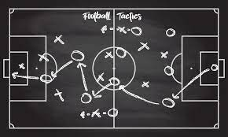

__This is a landing page of Chenyao Ni (Cary)__

\center

Nice to see you.
My name is Chenyao Ni. I’m currently a first-year student pursuing MS degree in Biostatistics (Public Health Data Science Track) at Columbia University, Mailman School of Public Health. After getting my BS degree in Molecular and Cellular biology at University of Illinois at Urbana Champaign, I find my interest in the analysis and application of those data from the lab and I believe my experience as a practitioner of those experiments could provide me with a better instinct when interpreting the data in the field of health science. 

# Relevent Projects
-> Issue of insufficient sleep
Here is a data science project investigating the physiological and socioeconomic factors  related to insufficient sleep completed by our group. The statistical models such as lasso regression, elastic net, and boosting are used for prediction. [Sleep Project](jchaicc.github.io/final.github.io/)

-> Courses rating app
Here is an application development project which could be used by students to check the courses offered on-campus and rate the courses they have taken. [Here](https://github.com/caryni01/Course-selection-app/tree/main/MP-Fall2020-chenyao4-master)

For other projects, please check my github page [Here](https://github.com/caryni01)

# Personal interests and future goals

I have been a football (aka.soccer) fan and my favorite clubs are Bayern München and Arsenal FC since 2010. I regard being a data analyst or strategy analyst for a football club as my long-term goal in ten years because I believe knowing the field that generates data is as important as knowing how to deal with data. 

\center